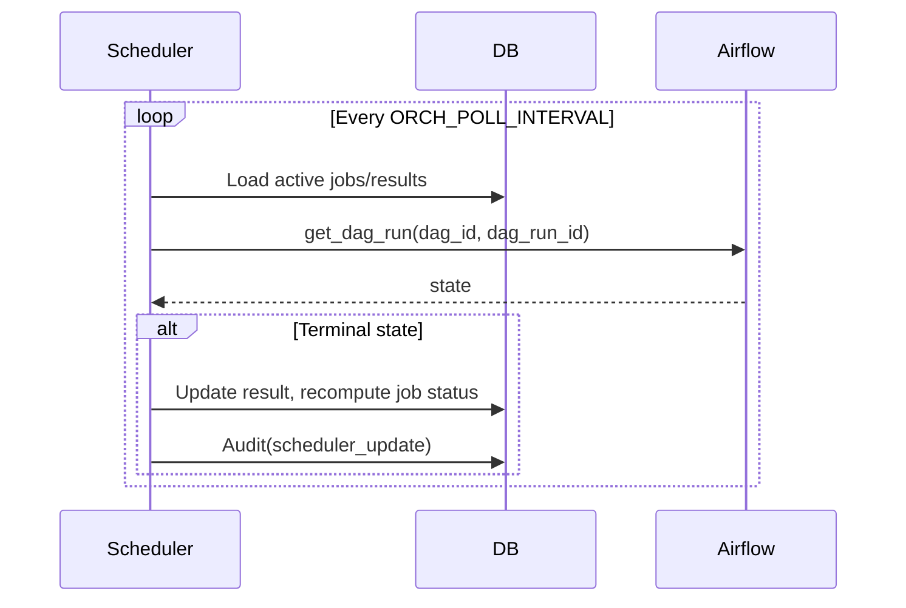

# Certification Service Backend Architecture

## Introduction

### Background
This service orchestrates and tracks certifications for script repositories via Airflow. It exposes REST endpoints, persists state in a database via SQLAlchemy, integrates with external providers (GitLab), and emits audit logs for all key operations.

### Scope
This document summarizes the runtime architecture, main components, orchestration/scheduler flows, and audit logging.

## Components

### API Layer
- FastAPI application defined in src/api/main.py.
- Endpoints grouped into Health, Certifications, Mappings, Metadata, and Webhooks.

### Core Services
- Orchestration (src/core/orchestration.py): triggers Airflow DAGs per certification type, records dag_run_id, updates result statuses, and logs audit events.
- Scheduler (src/core/scheduler.py): background loop that reconciles active jobs by polling Airflow for terminal states.
- Airflow Client (src/core/airflow_client.py): async httpx client to trigger and check DAG runs.
- Repository Adapters (src/core/repo_adapters.py): provider abstraction to enrich job metadata and resolve commit SHAs (GitLab supported).
- Database (src/core/db.py, src/core/migrations.py): async engine/session factory and model initialization.
- Configuration (src/core/config.py): Pydantic Settings sourced from environment.
- Audit (src/core/audit.py): utilities to persist audit logs, extract actor information, and capture request context.

### Data Models
- ORM models: AuditLog, CertificationJob, CertificationResult, BranchEnvironmentMapping, MetadataItem (src/models/db_models.py).
- API schemas: requests/responses and enums (src/models/schemas.py).

## Orchestration Flow

### Trigger from API
- Client POSTs /certifications with repository and types.
- Service persists CertificationJob and pending CertificationResult rows.
- Background task loads job and calls orchestrate_job.

### Orchestrator behavior
- For each certification type:
  - Resolve DAG id from Settings.airflow_dag_map.
  - Trigger Airflow DAG with conf including run_id, repo details, types, environment, and metadata.
  - Mark result as running and store dag_run_id in metrics.
  - Emit audit logs for orchestrate_trigger and orchestrate_running.
- A background asyncio task per type polls Airflow until success/failed; terminal state updates CertificationResult and recomputes job status, with audit orchestrate_terminal.

### Scheduler behavior
- On startup, an in-process scheduler loop starts.
- Periodically loads active jobs and for each non-terminal result attempts to fetch its Airflow state via dag_id/dag_run_id saved in metrics.
- When a terminal state is detected, updates the result and recomputes the job status; emits audit scheduler_update.

### Mermaid sequence: Orchestration
```mermaid
sequenceDiagram
  participant Client
  participant API
  participant DB
  participant Orchestrator
  participant Airflow

  Client->>API: POST /certifications (TriggerCertificationRequest)
  API->>DB: Insert CertificationJob + Results
  API->>DB: Audit(action="create", resource="certification_job")
  API-->>Client: 201 CertificationRunResponse
  API->>Orchestrator: Background task with run_id
  Orchestrator->>Airflow: trigger_dag(dag_id, conf)
  Orchestrator->>DB: Update result status=running; save dag_run_id
  Orchestrator->>DB: Audit(orchestrate_trigger, orchestrate_running)
  loop Poll per-type
    Orchestrator->>Airflow: get_dag_run()
    Airflow-->>Orchestrator: state (success/failed/...)
    Orchestrator->>DB: Update result to passed/failed
    Orchestrator->>DB: Audit(orchestrate_terminal)
  end
```

### Mermaid sequence: Scheduler reconciliation


## Security and CORS

- Bearer token authentication for mutating endpoints (POST/PATCH) is enforced via Authorization: Bearer <token>. Tokens are configured using the AUTH_BEARER_TOKENS environment variable (comma-separated). In development, if AUTH_BEARER_TOKENS is unset, mutating endpoints are allowed to ease local testing; in non-development environments, tokens are required.
- Webhook security supports:
  - Shared-secret headers: X-Webhook-Secret (WEBHOOK_SECRET) and X-Gitlab-Token (GITLAB_WEBHOOK_SECRET). If unset, development mode accepts requests.
  - HMAC signature validation when WEBHOOK_HMAC_SECRET is set. Clients must include:
    - X-Signature: hex-encoded HMAC of the raw request body.
    - X-Signature-Algo: sha256 (default) or sha1.
  Requests failing validation receive 401 Unauthorized.
- CORS is environment-driven:
  - Development: allow all origins by default.
  - Non-development: wildcard "*" for CORS_ALLOW_ORIGINS is not permitted. If "*" is set, the service restricts to an empty whitelist (deny all) until explicit origins are provided via CORS_ALLOW_ORIGINS.

## Webhook Flows

### GitLab trigger
- Validates X-Gitlab-Token or X-Webhook-Secret if configured; optional HMAC signature validation if WEBHOOK_HMAC_SECRET is set.
- For push events, creates a default certification job (type=code_quality) and triggers orchestration.
- Emits audit webhook_create with payload snapshot and secrecy indicators.

### Airflow update
- Validates X-Webhook-Secret if configured; optional HMAC signature validation if WEBHOOK_HMAC_SECRET is set.
- Updates the specific result or all non-terminal results for the given run_id and recomputes the job status.
- Emits audit webhook_update with payload snapshot and secrecy indicators.

## Audit Logging

### Persistence
- AuditLog rows are created for all key operations: API mutations, webhooks, orchestrator state transitions, and scheduler updates.

### Actor and request context
- Actor extracted from headers: X-User-Id, X-User, X-Forwarded-User, or Authorization scheme indicator (e.g., "bearer").
- Request context captures method, path, query, client, selected safe headers, and environment.

## Conclusion

### Summary
The service provides an API-driven orchestration layer around Airflow with robust state reconciliation and comprehensive audit logging. Configuration is environment-driven, with bearer token auth for mutations, optional HMAC-secured webhooks, and production-safe CORS defaults. Its configuration, adapters, and DAG mappings allow it to integrate cleanly into varied environments.
